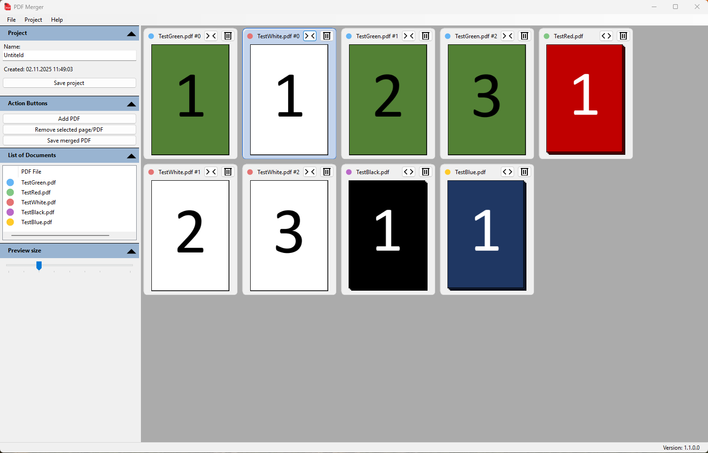

# PdfMerger
Standalone Windows application for merging PDF files

## Key Features
* Visual drag-&-drop interface for adding, rearranging and merging pages and documents.
* Thumbnail previews for each document with intuitive page-order control.
* Basic metadata editing (Title, Author, Subject, Keywords) built-in.
* Lightweight installer ready for distribution (.exe via NSIS).

## Implemented Features
* Metadata editor
* Hover highlights & selected page color
* Undo/Redo for sorting
* Dark/Light theme toggle
* Recent projects list
* Localization using .resx files

## Feature requests
* Security flag editor
* Recent projects
* Shortcuts

## Possible new features
* Metadata editor (custom elements)
* Tooltips with PDF info (name, page count, size, date)
* Select page ranges when importing (e.g. 1–3, 5–7)
* Rotate / delete / duplicate pages
* Insert blank page (black/white)
* Metadata templates (default values)
* Quick copy metadata from other documents
* Metdata: Custom fields (e.g., “Project ID”)
* Autosave & temporary recovery
* ~~Multiple projects in tabs~~
* ~~Cloud path detection (OneDrive, Dropbox)~~
* Password protection / encryption
* Watermark (text or image)
* Compress / optimize PDFs
* Auto-update mechanism
* Crash log / error report

# License
This project is licensed under the Apache 2.0 License, meaning it’s free to use, modify and distribute in open or closed-source projects, with attribution.
